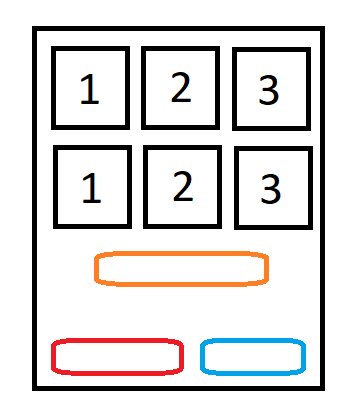

# Projeto simples para automatização de uma lanchonete online

* Criar uma função para calcular o valor subtotal
* Criar um Botão para mostrar o carrinho
* Melhorar o Layout

## EXT IDS
- Cadastrar Produto e preço UI
(Guardanapo R$0.1)
- Pedidos diferentes;

## IDEIAS EXTRAS
- Inserir uma Treeview demonstrando um cardápio visual

### Imagem de referência para o App:

Legenda:
- Itens
- Laranja: Notificações de atualização
- Azul: Confirmação | Carrinho
- Vermelho: Limpar carrinho